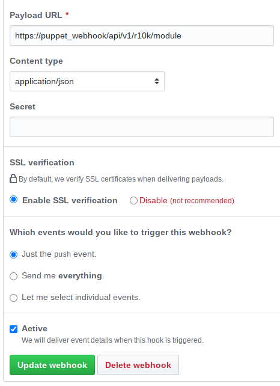

# Puppet Webhook Server

[](https://github.com/voxpupuli/puppet_webhook/blob/master/LICENSE)
[](https://travis-ci.org/voxpupuli/puppet_webhook)
[](https://codeclimate.com/github/voxpupuli/puppet_webhook/maintainability)
[](https://codeclimate.com/github/voxpupuli/puppet_webhook/test_coverage)
[](https://www.codacy.com/app/VoxPupuli/puppet_webhook?utm_source=github.com&amp;utm_medium=referral&amp;utm_content=voxpupuli/puppet_webhook&amp;utm_campaign=Badge_Grade)
[](https://coveralls.io/github/voxpupuli/puppet_webhook?branch=master)

## What is puppet_webhook

puppet_webhook is a Sinatra-based application receiving REST-based calls to trigger Puppet and r10k-related tasks such as:

* Webhooks from Source Code systems to trigger r10k environment and module deploys
* Send notifications via Slack

## Prerequisites

* Ruby 2.5.0 or greater (since version 2. 1.x works with Ruby 2.4.0)
* Puppet 5.5.0 or greater
* r10k gem
* *Optional*: MCollective and MCollective-r10k (Provides one form of multi-master syncronization)
    * Currently Mcollective-r10k is only available from [puppet-r10k](https://github.com/voxpupuli/puppet-r10k)
    * If you don't want to use MCollective, you could install this webhook on each compile master instead

## Installation

### Legacy puppet_webhook (< 2.x)

Please see the pre-2.x [documentation](docs/LEGACY.md) if using the old gem-based puppet_webhook.

### Modern puppet_webhook (>= 2.x)

#### Ubuntu/Debian

Add the Voxpupuli GPG key and repository:
```bash
wget -qO - "https://bintray.com/user/downloadSubjectPublicKey?username=voxpupuli" | sudo apt-key add -
echo "deb https://dl.bintray.com/voxpupuli/deb $(awk -F= '/VERSION_CODENAME=/ {print $2}' /etc/os-release) main" | sudo tee -a /etc/apt/sources.list.d/voxpupuli.list
sudo apt update
```

Install puppet_webhook
```bash
sudo apt install puppet-webhook
```

#### RedHat/CentOS/Oracle/Amazon

Download the voxpupuli.repo file
```bash
wget https://raw.githubusercontent.com/voxpupuli/puppet_webhook/master/build/repos/voxpupuli.repo -o voxpupuli.repo
sudo mv voxpupuli.repo /etc/yum.repos.d/voxpupuli.repo
```

Install puppet_webhook
```
yum install puppet-webhook
```

#### Docker Compose
Experience with Docker and Docker Compose are assumed. The Docker Compose setup expects that the Webhook API container volumes will have access to the codedir, either via NFS or on system.

1. Download the sample `docker-compose.yml` file from the github repo:
```
$ wget -O docker-compose.yml https://raw.githubusercontent.com/voxpupuli/puppet_webhook/master/build/docker/docker-compose.yml
```
2. Edit the image, environment, and volumes keys based on your own needs.
3. run `docker-compose up`

#### Generic

This assumes you already have the correct Ruby version installed in the system or via a tool like `rbenv`, `rvm`, or `asdf`.

1. Download the latest release from the [Releases](https://github.com/voxpupuli/puppet_webhook/releases) page.
2. Extract the tarball into the desired directory:
```bash
$ tar -xzvf puppet_webhook-latest.tar.gz -C /opt/puppet_webhook
```
3. Enter the install directory and install dependencies:
```bash
$ cd /opt/puppet_webhook && bundle install
```
4. Start the process:
```bash
$ bundle exec puma config.ru
```

## Configuration

Puppet Webhook API configuration is maintained by the config.yml file in the `APP_ROOT/config` directory. Many options have sane defaults applied, but a few are required for base functionality.

### Authentication

#### `protected`

type: Boolean
description: Enforces authentication via basic auth or API token.
default: false

#### `user`

type: String
description: Username to use for Basic Authorization. Optional
default: `nil`

#### `password`

type: String
description: Password to use for Basic Authorization. Optional
default: `nil`

### Chatops Notifications

#### `chatops`

type: Boolean
description: Send notifications to a chatops service. Required.
default: false

#### `chatops_service`

type: String
description: Which chatops service to send to. Only `slack` and `rocketchat` supported at this time.
default: `nil`

#### `chatops_url`

type: String
description: Webhook/Notification url to send to.
default: `nil`

#### `chatops_channel`

type: String
description: Channel/Room to post notification to.
default: `nil`

#### `chatops_user`

type: String
description: User to post notification as.
default: `nil`

#### `chatops_options`

type: String
description: Any additional options to pass the chatops service.
default: `nil`

### R10K Settings

#### `default_branch`

type: String
description: Default controlrepo branch to use if none specified.
Default: `production`

#### `ignore_environments`

type: Array[String]
description: Any environments to ignore.
Default: []

#### `allow_uppercase`

type: Boolean
description: Allow uppercase within the name of the module or environment passed to the API.
default: true

### Redis/Sidekiq Settings

#### `redis_url`

type: String
description: The Redis connection url to use to connect to your Redis database.
default: `redis://localhost:6379/0`

#### `redis_password`

type: String
description: The password to authenticate to Redis with.
default: `nil`

### Logging Settings

#### `loglevel`

type: String
description: Set the Logging level for the application. Valid values are `debug`, `error`, `warn`, `fatal`, and `info`.
default `warn`

### Configure the webhook

This API provides two endpoints that need to be called:

* `/api/v1/r10k/module` for every module
* `api/v1/r10k/environment` for the control repository

In GitHub, set setup looks like this:

!

If you configured basic authentication, you need to add the username and password to the URL.
